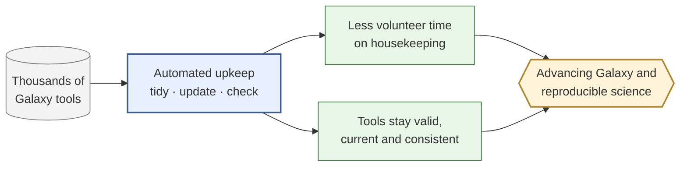

# For leadership — what this is and why it matters

> **In one sentence:** this project automates the tedious, error-prone upkeep of
> Galaxy's analysis tools, so scientists and maintainers spend less time on
> housekeeping and more on science — and so the tools stay correct and reproducible.

## The problem, plainly

Galaxy is how a huge community runs reproducible bioinformatics. Every analysis tool
in Galaxy is described by a small configuration file. There are **thousands** of them,
maintained by volunteers. These files drift: the platform evolves, conventions change,
and keeping every tool tidy, valid, and up to date is slow, manual, and easy to get
wrong. That maintenance burden falls on a small number of expert volunteers — and it
competes directly with their time for actual research.

## What this project does

It turns much of that upkeep into something a computer can do reliably:

- **Tidies** tool files into a single consistent style.
- **Updates** tools to keep pace with the platform, making only the changes it can
  verify are safe.
- **Checks** tools against community best practices and reports what's missing.

In practice that can be dramatic: in one real case it brought a tool written for a
**2018-era version of Galaxy up to the current (2026) platform in a single step** —
applying only the changes it could verify were safe.

It works the same way whether a person runs it at the command line or an **AI assistant**
runs it on their behalf — which means it can plug into modern, automated workflows.

It is **grounded in evidence**: its behaviour is tuned against a library of **9,358 real
Galaxy tools**, so its decisions reflect how tools are actually written, not assumptions.

## Why it matters

- **Maintainer time is the scarce resource.** Automating housekeeping returns expert
  volunteer hours to science.
- **Reproducibility depends on tool correctness.** Consistent, valid, current tools mean
  analyses behave the same way tomorrow as they do today — the core promise of Galaxy
  and of reproducible science.
- **It strengthens the Galaxy ecosystem** rather than competing with it: it's designed to
  complement the community's existing tooling (see [vs planemo](vs-planemo.md)).

## Honest about today vs. tomorrow

**Today, it really does** format, safely upgrade, and check individual tools — usable now
as a command-line tool, a software library, and a service that AI agents can call.

> **Where it's going (not yet built).** The larger prize is *automation at scale*: a
> system that works through an entire tool collection and proposes fixes for review in
> manageable batches, and assistance that helps streamline the community's tool-review
> process. The per-tool engine that such automation would stand on exists today; the
> automation around it is the roadmap, not a current claim.

One honest limit, in plain terms

When it "upgrades" a tool, it guarantees the result is still a *valid* tool. It does **not**
blindly promise the tool behaves identically afterward — it only makes behaviour-changing
edits when it can prove they're safe, and otherwise flags them for a human. That caution is
deliberate: it's what makes the automation trustworthy.

---

*Every capability above is tracked, with its evidence and maturity, in
[capabilities](capabilities.md).*
