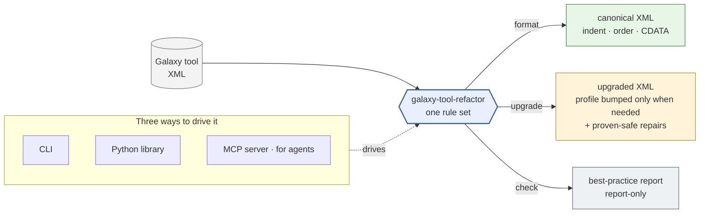

# galaxy-tool-refactor — guide

> **In one sentence:** galaxy-tool-refactor reads a Galaxy tool's XML and can
> **format it, fix it, upgrade it, and flag best-practice gaps** — from the command
> line, a Python library, or an MCP server an AI agent can drive.



*Colour = guarantee: **green** behaviour-preserving · **amber** bounded (see
[soundness](soundness.md)) · **grey** report-only.*

## What it is, plainly

Galaxy tool definitions are XML files. Over the years Galaxy's tool format has grown
**profiles** (versioned behaviour), and the community (the IUC) has converged on
**conventions** for how a well-formed tool should look. Keeping thousands of tools
tidy, valid, and current is real, repetitive work.

This project turns much of that work into **one rule set you can run**:

- **Format** — apply the canonical, IUC-style layout (indentation, attribute and
  element order, CDATA wrapping). Safe and idempotent; never changes behaviour.
- **Upgrade** — move a tool to the newest profile it can *structurally* reach (e.g. a
  real tool jumped `profile="18.01"` → `"26.1"`), with the conservative repairs that
  bump needs — opt-in and semantic.
- **Check** — report where a tool falls short of best practice (missing tests, no
  version pins, …). Report-only.

It is **evidence-driven**: design decisions are backed by sweeps over a corpus of
**9,374 real Galaxy tools**, not guesses.

On a tool that already follows IUC conventions, `format` and `check` are often quiet —
there the value is the **upgrade** and the best-practice report.

## Pick your path

You won't need all of this. Start where you are:

| You are… | Start here | You'll learn |
|---|---|---|
| a **PI / non-technical reader** | [for-leadership](for-leadership.md) | what this is worth, in plain language |
| an **IUC maintainer or tool author** | [for-maintainers](for-maintainers.md) | what it fixes/flags in a PR, and how to run it |
| an **AI agent (or building one)** | [for-agents](for-agents.md) | the MCP tools + library API as a substrate |
| here to **use it now** | [cli](usage/cli.md) · [library](usage/library.md) · [mcp](usage/mcp.md) | runnable examples |

## The honest baseline

This guide holds itself to two rules:

1. **It won't overwhelm you.** Every page goes simple → detailed; you can stop at any
   point and have a complete picture.
2. **It won't overclaim.** Every "it does X" is traceable to a real artifact, and is
   tagged **Shipped / Partial / Roadmap** in **[capabilities](capabilities.md)** — the
   one page every other page defers to.

<details>
<summary>The one caveat worth knowing up front</summary>

The default `upgrade` moves `profile=` only when strictly needed for validity;
modernizing further is the explicit `--modernize` walk, which stops rather than
cross a breaking Galaxy behaviour change it cannot prove fixed for your tool
(the stop report tells you what to do next), and the result is **structurally
valid** at the profile it declares. Going past that boundary
is an explicit flag, and behaviour-affecting edits are made only where the tool can
*prove* them safe; otherwise they're reported, not applied. The full boundary is in
**[soundness](soundness.md)**.
</details>

## Going deeper

- **[capabilities](capabilities.md)** — the full Shipped/Partial/Roadmap matrix.
- **[soundness](soundness.md)** — what "safe upgrade" does and doesn't guarantee.
- **[leverage](leverage.md)** — where this fits in the Galaxy ecosystem.
- **[vs planemo](vs-planemo.md)** — how it complements the tools you already use.
- **[`ARCHITECTURE.md`](https://github.com/richard-burhans/galaxy-tool-refactor/blob/main/ARCHITECTURE.md)**
  — for people working *on* the project.

```{toctree}
:hidden:
:maxdepth: 2

for-leadership
for-maintainers
for-agents
Using it <usage/cli>
usage/library
usage/mcp
capabilities
soundness
vs-planemo
leverage
```
